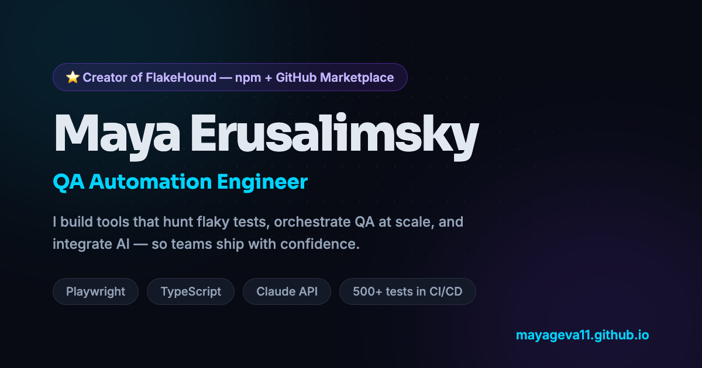

# Maya Erusalimsky - Portfolio

**Live site: [mayageva11.github.io](https://mayageva11.github.io)**

Personal portfolio of a QA Automation Engineer - Playwright, TypeScript, and AI-integrated test tooling.

---

## 🐕 Featured: FlakeHound

My flagship open-source project - **root-cause analysis for flaky tests**, published on [npm](https://www.npmjs.com/package/flakehound) and available as a [GitHub Marketplace action](https://github.com/mayageva11/flakehound).

Where existing tools count pass/fail rates and tell you *that* a test is flaky, FlakeHound tells you **why**:

- **Clusters failures by root cause** - normalises stack traces and groups structurally identical failures, turning *"23 failures over 3 weeks"* into *"4 unique bugs"*
- **Separates flaky from broken** - a test failing 100% since one commit isn't flaky, it's a regression; the two verdicts are mutually exclusive
- **Gates CI on *new* regressions only** - the build fails once when a bug lands, not on every run until it's fixed
- **AI hypothesis layer, local-first** - one-line root-cause hypotheses via local Ollama (zero cost, private) or the Claude API; the deterministic core works identically without either
- **Quarantine with auto-release** - tags high-confidence flaky tests via surgical AST edits, files one GitHub issue per test, and releases them automatically after N clean runs
- **Self-contained HTML dashboard** - one file, publishable straight to GitHub Pages: [live example](https://mayageva11.github.io/flakehound/)

**Links:** [CLI repo](https://github.com/mayageva11/flakehound) · [npm package](https://www.npmjs.com/package/flakehound) · [live dashboard](https://mayageva11.github.io/flakehound/) · [demo project](https://github.com/mayageva11/flakehound-demo)

## 🧪 NexusQA - end-to-end platform automation

Proof that I can automate *anything*: a realistic SaaS analytics application **and** the production-grade test suite that covers it, built as one project.

- **234 automated tests** across UI (E2E) and API layers
- **3 browsers** - Chromium, Firefox, WebKit
- TypeScript strict mode, Playwright, Allure reporting
- CI on every push plus nightly scheduled runs

**Links:** [live demo](https://mayageva11.github.io/nexusqa/) · [repo](https://github.com/mayageva11/nexusqa)

## More projects

| Project | What it is |
|---|---|
| [QuestForge](https://github.com/mayageva11/questforge) | System design interview prep as story-driven quests with AI-generated scenes - [live](https://mayageva11.github.io/questforge/) |
| [EduCare](https://educare-sigma-one.vercel.app/) | Full-stack school counselor platform - Next.js 15, MongoDB, Hebrew RTL, Ministry of Education forms ([live](https://educare-sigma-one.vercel.app/)) |
| [Job Dashboard](https://github.com/mayageva11/job-dashboard) | Automated job aggregation with weighted skills-match scoring and daily email digests |

## About this site

Built deliberately with **zero frameworks and zero build step** - pure HTML, CSS, and JavaScript, deployed straight to GitHub Pages.

- **Elite editorial aesthetic** - a warm, all-dark Bordeaux Noir palette with Vanilla Silk / Alpine Oat cream typography and Fraunces serif display headings; fully responsive
- Animated CLI terminal that replays a real `flakehound analyze` run, plus an interactive sandbox dashboard (Bug Clusters, Quarantine Board, Config Playground)
- Semantic HTML, keyboard-operable navigation, visible focus states, `prefers-reduced-motion` support throughout
- Cursor-tracking card glow, scroll-spy navigation, staged entrance choreography - all in vanilla JS

## Contact

- **Email:** [mayageva11@gmail.com](mailto:mayageva11@gmail.com)
- **LinkedIn:** [linkedin.com/in/maya-eru](https://www.linkedin.com/in/maya-eru/)
- **GitHub:** [github.com/mayageva11](https://github.com/mayageva11)
